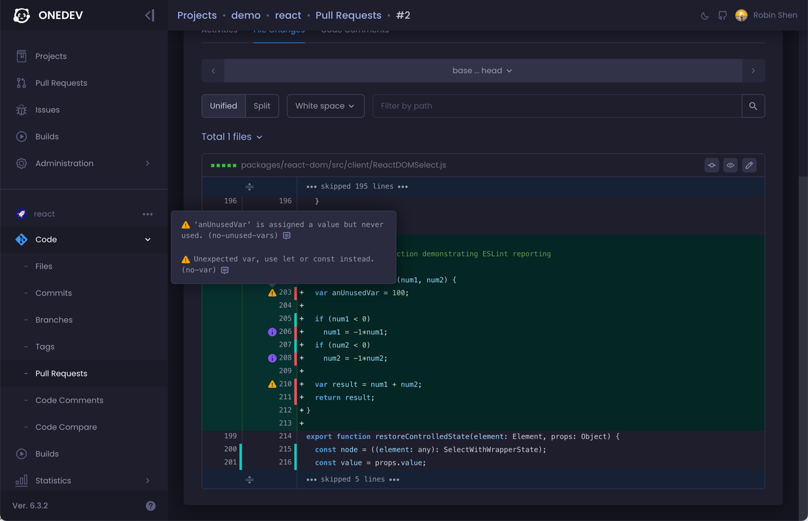
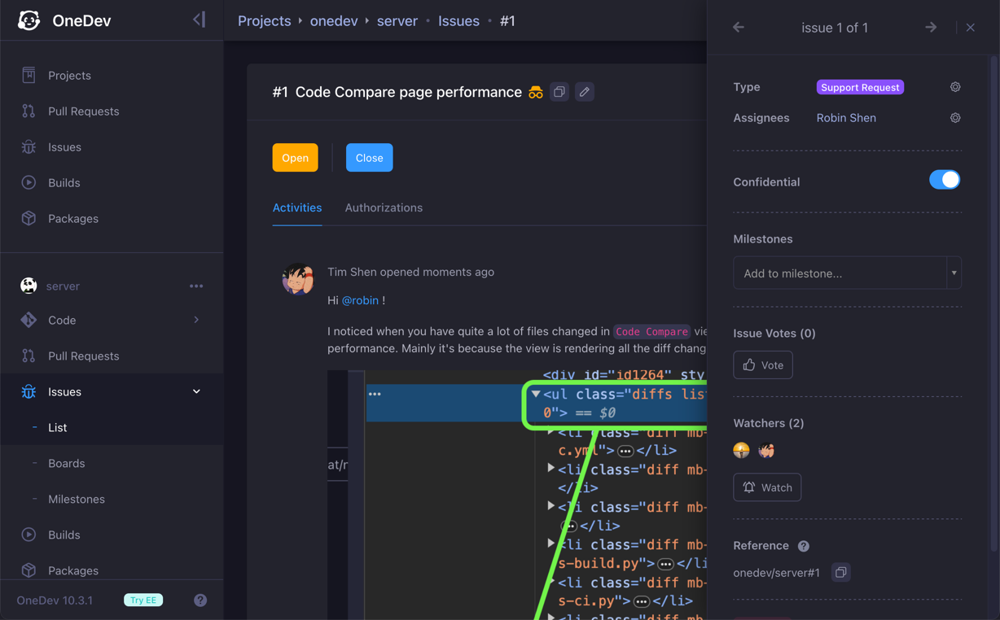
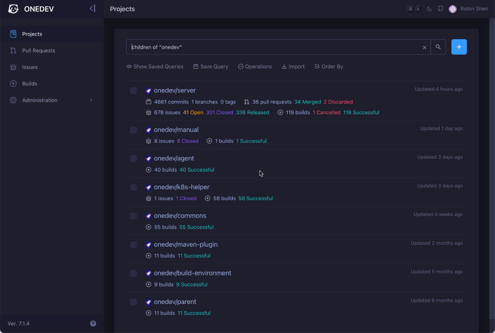
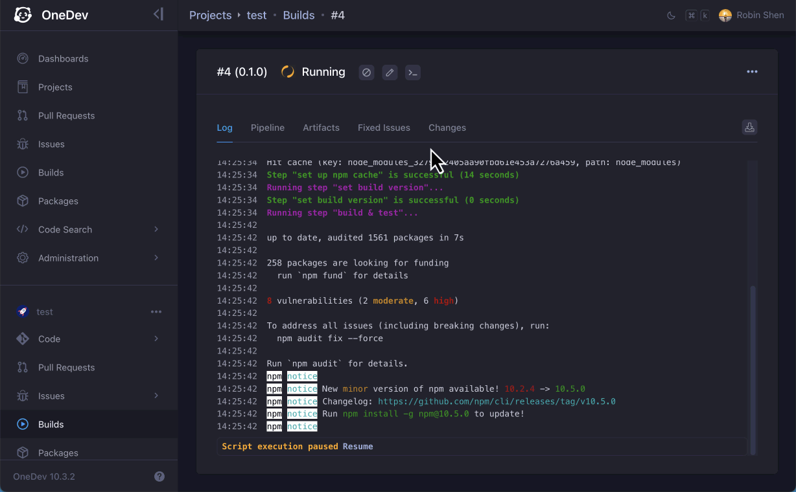

> **Note**
> 1. Do not worry about security advisories above. They are fixed as soon as discovered and published to notify users
> 1. We develop OneDev at <a href="https://code.onedev.io">code.onedev.io</a> for sake of dogfooding. Please submit issues and pull requests there

<h1>Self-hosted Git Server with Kanban and CI/CD</h1>

<h2>
<a href="https://docs.onedev.io">Quickstart</a> 
| <a href="https://docs.onedev.io/category/installation-guide">Installation Guide</a> 
| <a href="https://docs.onedev.io">All Documentation</a> 
</h2>

## Out-of-box Symbol Search and Navigation

Just push code and you will be able to perform symbol search and navigation in arbitrary commit without any extra setup. You can also jump to symbol definition in diff while reviewing commits or pull requests. 

It works by analyzing source code with ANTLR, extracting symbols for storage incrementally, fast and space efficient. Supports Java, JavaScript, C, C++, CSharp, Go, PHP, Python, CSS, SCSS, LESS and R. 

## Code Search with Regular Expression

You may switch to any commit, and search code with regular expression. OneDev under the hood indexes the code with Lucene incrementally. At search time, literal tri-grams in the regular expression are extracted for a coarse search, followed by exact match in the result. This makes the regex search blazing fast, even for large repositories like Linux.

## Annotate Source/Diff with Static Analysis Result to Facilitate Code Review

Of course this can be done by many third party applications at GitHub, however they display the result on their own applications, and this makes review activities such as adding comment over analysis result difficult. Not to mention that you need to pay for these services.

## Customizable Issue State and Field, with Deep CI/CD Integration

The simple open/close state of GitHub/GitLab issues does not work well for many workflows. Considering issues submitted by customers:

1. If developer closes issue upon committing the code, customer will be notified and may ask for the release fixing the issue.
2. If developer closes the issue at release time, QA might be confused at what issues to test as they all remain open at test time. 

With customizable issue states, we may address the issue with four states: open, committed, test ready and released:

1. When code is committed, issue transits to committed state automatically
2. When a test build is created and deployed, the issue transits to test ready state automatically. QA will be notified and can check issue detail to know which environment the test build is deployed into.
3. When test passes, and a release build is created, customers submitting the issue will be notified and they can check issue detail to see which release contains the fix. 

## Service Desk to Create/Discuss Issues via Email

Service desk allows your users to submit tickets via email without the need to have a OneDev account. These tickets can then be created in desired projects, and assigned to appropriate members in your team. All further discussions over the tickets can take place completely in email, with discussion contents posted to ticket as comments. User will also get notifications when there are any ticket activities, for instance, when a relevant release is created or deployed

## A powerful and Intuitive Query Language

Thanks to ANTLR again, OneDev ships sophisticated query languages for projects, commits, issues, builds, and pull requests, with intuitive auto-completions and hints. For instance, it enables our customers finding fixed issues between their running release and latest release, and enables us to find all commits submitted by someone touching specified modules, etc. 

Queries can be saved and subscribed, so that you won't miss anything interested.

## A Full-fledge CI/CD Engine without Writing Yaml

OneDev ships with GUI to generate CI/CD Yaml. No need to google around for Yaml grammars. A one-liner docker command to start OneDev server and you have a local CI/CD runner automatically. Concerns about server capability to run massive jobs? Another one-liner to connect self-updating agent from any machine. Want auto-scale CI/CD farm? A helm one-liner to deploy OneDev into k8s cluster. 

Build pipeline, matrix jobs, typed parameters, parameter chaining, step templates, build promotions… too many neat features to elaborate…

## Flexible Pull Request Review Policy and Reviewer Suggestion

Specify pull request review policy based on author, branch, and changed files. OneDev can leverage git change history to suggest most appropriate reviewers for pull requests touching certain files.

## Lightweight Review without Pull Request

Comment on any part of code or diff to start a lightweight review without opening pull request. Review comments live through code modification and even file rename to serve as documentation. 

Each discussion is threaded so that you can easily know discussions with new comments/updates.

## Command Palette to Access Features Quickly

Press cmd/ctrl-k to bring up command palette from anywhere. Search projects, files, issues, pull requests, builds, and various settings and jump to them without leaving your keyboard

## Write Markdown Pleasantly With a Smart Editor

When embedding an image in a markdown file in GitHub/GitLab, you need to upload the image in a separate page, and then figure out the relative path to reference that image. With OneDev, you simply upload the image to desired folder in same editor, and the link will be generated automatically. 

OneDev tracks your cursor in edit window and scrolls the preview window as necessary so that you can always preview what you are typing.

## SLOC Trend By Language

OneDev inspects git history of main branch to calculate trend of source lines of code by language efficiently. 

## Project Hierarchy to Facilitate Setting Inheritance

Organization is ideal for public service. However, for self-hosted internal use, we feel that a hierarchical structure is more practical to organize projects. Child projects can inherit settings from parent project and can selectively override some of them if necessary. This reduces a lot of overhead to manage a lot of projects in the company.

## Effortless High Availability and Scalability (Enterprise Edition)

Just connect multiple OneDev instances to same database, and you will get a cluster to distribute project load to multiple 
servers, as well as the ability to sync projects with its replicas in real time. If one server goes down, project replicas 
on other servers will become active immediately without data loss and service interruption. 

## Built-in Docker/NPM/Maven/NuGET/PyPi/RubyGems Registry (Enterprise Edition)

The out-of-box integration of binary packages, CI/CD,
code and issues makes information cross-reference a lot easier. For instance, different package
versions can be compared to show code changes or fixed issues, published packages will be linked
with CI/CD builds automatically etc

## Customizable Dashboard (Enterprise Edition)

Arrange gadgets in custom dashboard to get important information at a glance. Share dashboard with other users or groups, 
or make it public for everyone. 

## Time Tracking and Reporting (Enterprise Edition)

Track issue, milestone and project progress with estimated time and spent time. Log works directly, 
or start stopwatch while working. Aggregate estimate/spent time from subtasks to parent task 
automatically. Generate timesheets for work statistics and billing.

## Cross Project Fast Code Search (Enterprise Edition)

Cross project fast code search to find information scattered in multiple projects. Support to search by symbol and regular
expression. Works out of box without extra setup. 

## Web Terminal to Diagnose CI/CD Job (Enterprise Edition) 

A web terminal to access environment of running CI/CD job. Used together with pause instruction, one can check 
live environment of the job to help diagnostics, and resume the job afterwards.   

## Fast and Reliable with Moderate Resource Usage

OneDev is carefully designed with performance in mind. With a 2 core 2GB box, you will get all features above for medium-sized projects. 
It has been intensively used for more than 5 years, with battle-proven reliability. Fixing bugs is our highest priority, and there is 
normally few to no known bugs in the wild.
